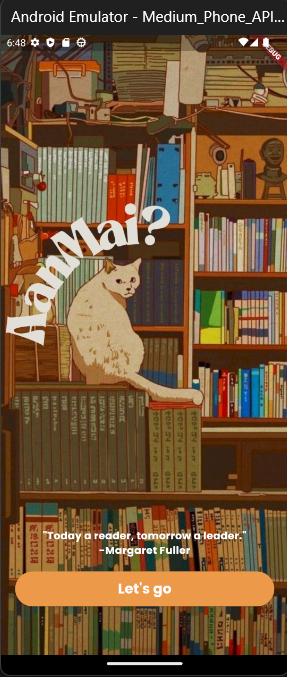
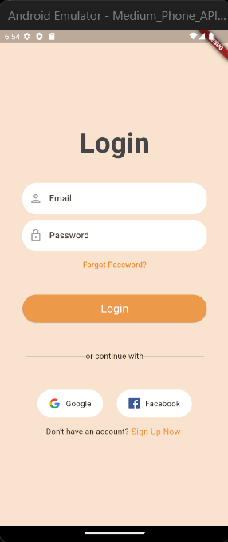
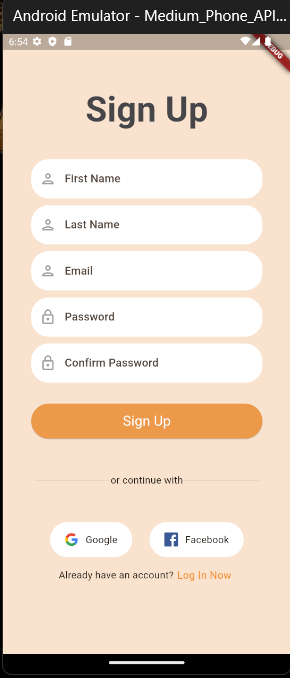
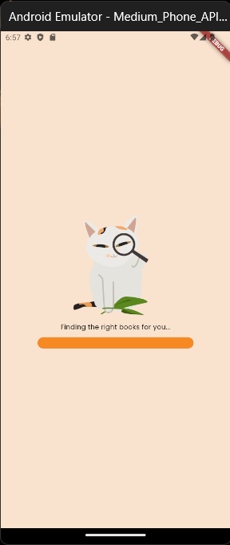
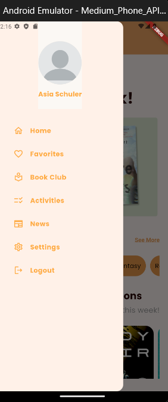
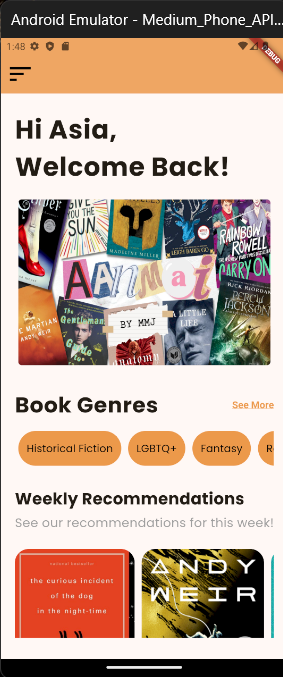
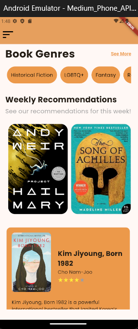
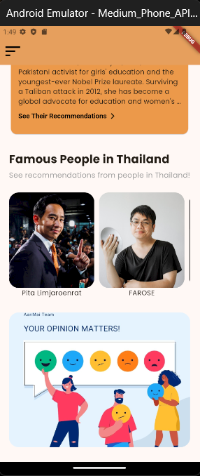
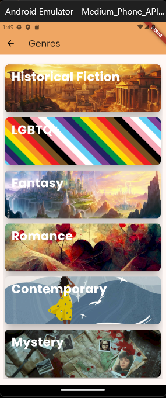

# Aanmai App

**Aanmai** is a mobile application designed to recommend a curated selection of books handpicked by our team and notable figures from various industries. Whether you're struggling to decide what to read or looking for inspiration from the books that have influenced your role models, Aanmai has you covered. The app is developed using **Flutter** for the front end and **Firebase** for the back end.

### Key Features:
- Personalized book recommendations based on genre and occasion.
- Recommendations from notable people across different industries.
- Ability to favorite books for easy reference.
- Read reviews and ratings from our team for recommended books.
- User authentication with email/password, Google, or Facebook.
- Direct links to purchase books from external sources.
- View ratings and reviews curated by our team.

## UI
|  |  |  |  |  |
| :-----------------------------------------------------: | :------------------------------------------------: | :----------------------------------------------------: | :----------------------------------------------------: | :----------------------------------------------------: |
|      |  |      |      |      |
|  |  |  |  |  |

